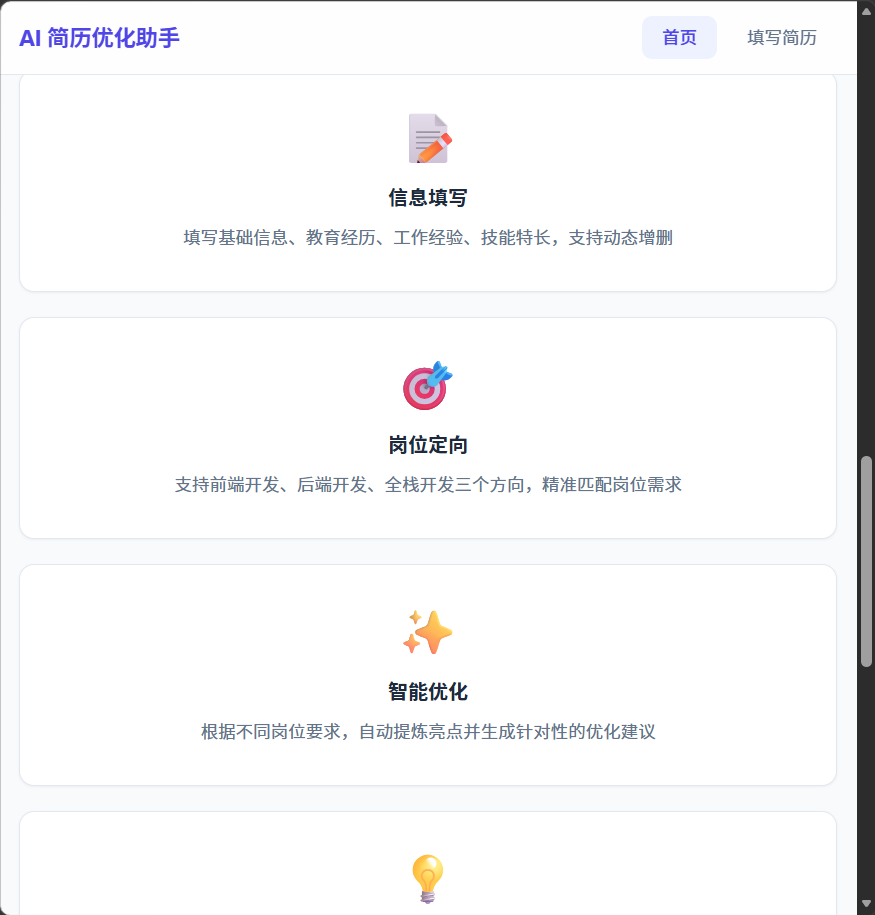
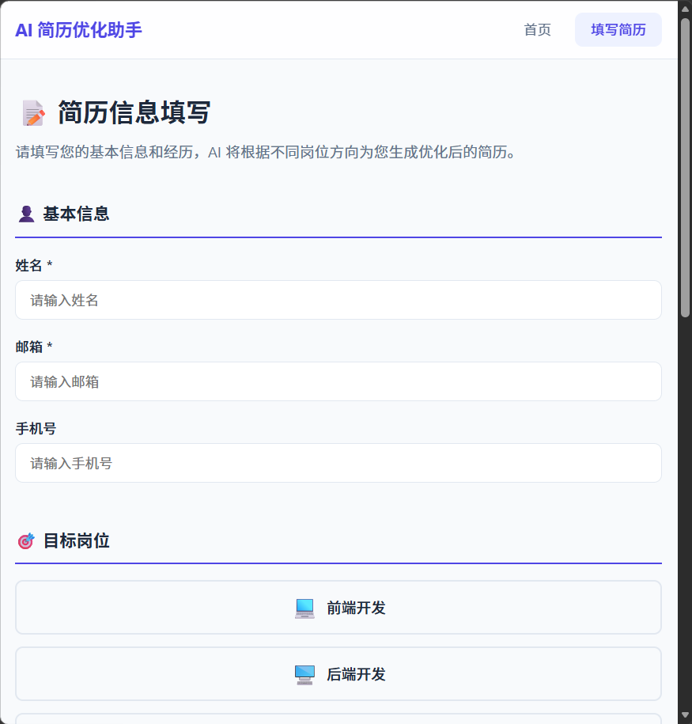
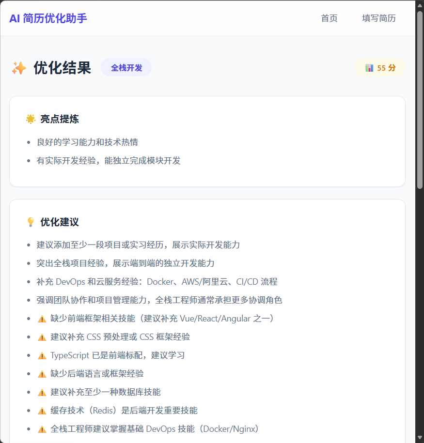

# AI 简历优化助手

<div align="center">

✨ **基于 AI 的智能简历优化工具** ✨

根据目标岗位（前端 / 后端 / 全栈）自动分析简历，提炼亮点、给出优化建议、生成专业简历文本。

[](https://vuejs.org)
[](https://www.typescriptlang.org)
[](https://expressjs.com)
[](https://www.mysql.com)
[](https://vitejs.dev)

</div>

## 📸 项目截图

| 首页 | 填写简历 | 优化结果 |
|:---:|:---:|:---:|
|  |  |  |

> 💡 截图保存到 `screenshots/` 文件夹后即可显示

---

## 📖 项目背景

求职过程中，简历是获得面试机会的关键。不同岗位（前端/后端/全栈）对简历的侧重点完全不同——同样的项目经历，投前端应该强调 UI/UX 和性能优化，投后端则应突出系统架构和数据库设计。

本项目模拟了这一场景：**用户填写基础信息 → 选择目标岗位 → AI 生成针对性优化简历**，帮助求职者（尤其是实习生/应届生）写出更匹配岗位要求、通过率更高的简历。

## 🏗 技术架构

```
┌───────────────────────────────────────────────┐
│                   前端 (Vue3)                   │
│  Vite + Vue Router + TypeScript               │
│  localhost:5173                               │
│        │                                       │
│        │ Vite Proxy /api → :3000               │
│        ▼                                       │
│              后端 (Node.js + Express)           │
│  ┌─────────────┬──────────────┬─────────────┐ │
│  │  Middleware  │  Controller  │   Service   │ │
│  │  · validate  │  · optimize  │  · aiProvider│ │
│  │  · logger    │  · history   │  · resume   │ │
│  └─────────────┴──────────────┴─────────────┘ │
│                      │                         │
│              ┌───────┴───────┐                 │
│              ▼               ▼                 │
│         MySQL (持久化)    Memory (降级)          │
└───────────────────────────────────────────────┘
```

## 📁 目录结构

```
ai-resume-optimizer/
├── frontend/                   # Vue3 + TypeScript 前端
│   ├── src/
│   │   ├── api/index.ts        # API 调用封装
│   │   ├── types/index.ts      # 类型定义
│   │   ├── router/index.ts     # 路由配置
│   │   ├── views/
│   │   │   ├── Home.vue        # 首页（项目介绍）
│   │   │   ├── ResumeForm.vue  # 简历填写表单
│   │   │   └── Result.vue      # 优化结果展示
│   │   ├── assets/style.css    # 全局样式（CSS Variables）
│   │   ├── App.vue             # 根组件
│   │   └── main.ts             # 应用入口
│   ├── vite.config.ts          # Vite 配置（含 API 代理）
│   └── package.json
├── backend/                    # Node.js + Express 后端
│   ├── src/
│   │   ├── routes/resume.ts    # 路由定义
│   │   ├── controllers/        # 请求处理
│   │   ├── services/
│   │   │   ├── aiProvider.ts   # AI 服务抽象（Mock + 预留 AI API）
│   │   │   └── resume.ts       # 业务逻辑（双模式存储）
│   │   ├── models/resume.ts    # 数据模型（MySQL CRUD）
│   │   ├── middleware/          # 中间件（校验/日志/错误处理）
│   │   ├── config/             # 配置（数据库/AI/端口）
│   │   └── types/index.ts      # 类型定义
│   ├── scripts/init.sql        # 数据库建表脚本
│   ├── .env.example            # 环境变量模板
│   └── package.json
├── .gitignore
└── README.md
```

## 🚀 快速开始

### 环境要求

- **Node.js** ≥ 18
- **MySQL** 8.0（可选，不安装则自动使用内存存储）

### 安装与运行

```bash
# 1. 克隆项目
git clone https://github.com/18000978795/ai-resume-optimizer.git
cd ai-resume-optimizer

# 2. 安装依赖
cd backend && npm install
cd ../frontend && npm install
cd ..

# 3. 启动后端（终端 1）
cd backend
npm run dev
# → http://localhost:3000

# 4. 启动前端（终端 2）
cd frontend
npm run dev
# → http://localhost:5173
```

### 可选：接入 MySQL

```bash
# 创建数据库
mysql -u root -p < backend/scripts/init.sql

# 配置环境变量
cp backend/.env.example backend/.env
# 编辑 .env，填入数据库密码

# 重启后端即可自动切换为 MySQL 持久化
```

## ✨ 功能模块

| 模块 | 功能 | 说明 |
|------|------|------|
| 📝 简历填写 | 基本信息、教育经历、项目经验、技能特长 | 支持动态增删，表单校验 |
| 🎯 岗位选择 | 前端 / 后端 / 全栈 | 不同岗位生成不同侧重点的简历 |
| 🤖 智能优化 | 技能分类、亮点提炼、缺口分析 | 模拟 AI 逻辑，预留真实 API 接口 |
| 📊 简历评分 | 0-100 分完整度评估 | 基于信息完整度和技能覆盖度 |
| 📋 一键复制 | 复制优化后的简历文本 | 含降级兼容方案 |
| 💾 下载文本 | 下载简历为 .txt 文件 | 方便保存和分享 |
| 📜 历史记录 | 查看所有优化记录 | 支持分页查询 |

## 🔧 API 接口

| 方法 | 路径 | 说明 |
|------|------|------|
| `GET` | `/api/health` | 健康检查（含存储模式） |
| `POST` | `/api/resume/optimize` | 提交简历并获取优化结果 |
| `GET` | `/api/resume/result/:id` | 查询单条优化结果 |
| `GET` | `/api/resume/history?page=1&pageSize=10` | 分页查询历史记录 |

### POST /api/resume/optimize 请求示例

```json
{
  "name": "张三",
  "email": "zhangsan@example.com",
  "phone": "13800000000",
  "education": [
    { "school": "北京大学", "degree": "本科", "major": "计算机科学",
      "startDate": "2020-09", "endDate": "2024-06" }
  ],
  "experience": [
    { "company": "某科技公司", "role": "前端实习生",
      "startDate": "2023-07", "endDate": "2023-12",
      "description": "负责官网重构，使用 Vue3 + TypeScript 技术栈" }
  ],
  "skills": ["Vue3", "TypeScript", "React", "Node.js", "Git"],
  "targetPosition": "frontend",
  "additionalInfo": "期望从事前端开发工作"
}
```

### 响应示例

```json
{
  "code": 0,
  "message": "优化成功",
  "data": {
    "id": "res_1718000000_1",
    "createdAt": "2026-06-13T08:00:00.000Z",
    "targetPosition": "frontend",
    "score": 90,
    "highlights": [
      "具备前端 Vue3、TypeScript、React 技术能力",
      "技能覆盖面广，掌握 5 项技术",
      "有实际开发经验，能独立完成模块开发"
    ],
    "suggestions": [
      "在项目中强调性能优化相关的经验：懒加载、代码分割、资源压缩等",
      "补充前端工程化经验：Webpack/Vite 配置、CI/CD 流程、自动化测试",
      "⚠️ 建议补充 CSS 预处理或 CSS 框架经验"
    ],
    "optimizedResume": "张三 | 求职意向：前端开发工程师\n\n📧 zhangsan@example.com..."
  }
}
```

## 🎨 设计亮点

- **三层架构**：routes → controllers → services，职责清晰，易于扩展
- **AI 抽象层**：`aiProvider.ts` 定义接口，Mock 实现可一键替换为真实 AI API
- **双模式存储**：MySQL 可用时自动持久化，不可用时自动降级到内存存储
- **请求校验**：中间件统一校验输入（必填字段/邮箱格式/岗位白名单）
- **类型安全**：前后端 TypeScript 全覆盖，类型定义保持同步
- **零跨域困扰**：Vite 开发代理转发 `/api` 到后端，开发体验流畅
- **优雅降级**：数据库/网络异常时自动回退，不影响核心功能


## 📄 License

MIT — 随意使用，欢迎 Star ⭐
